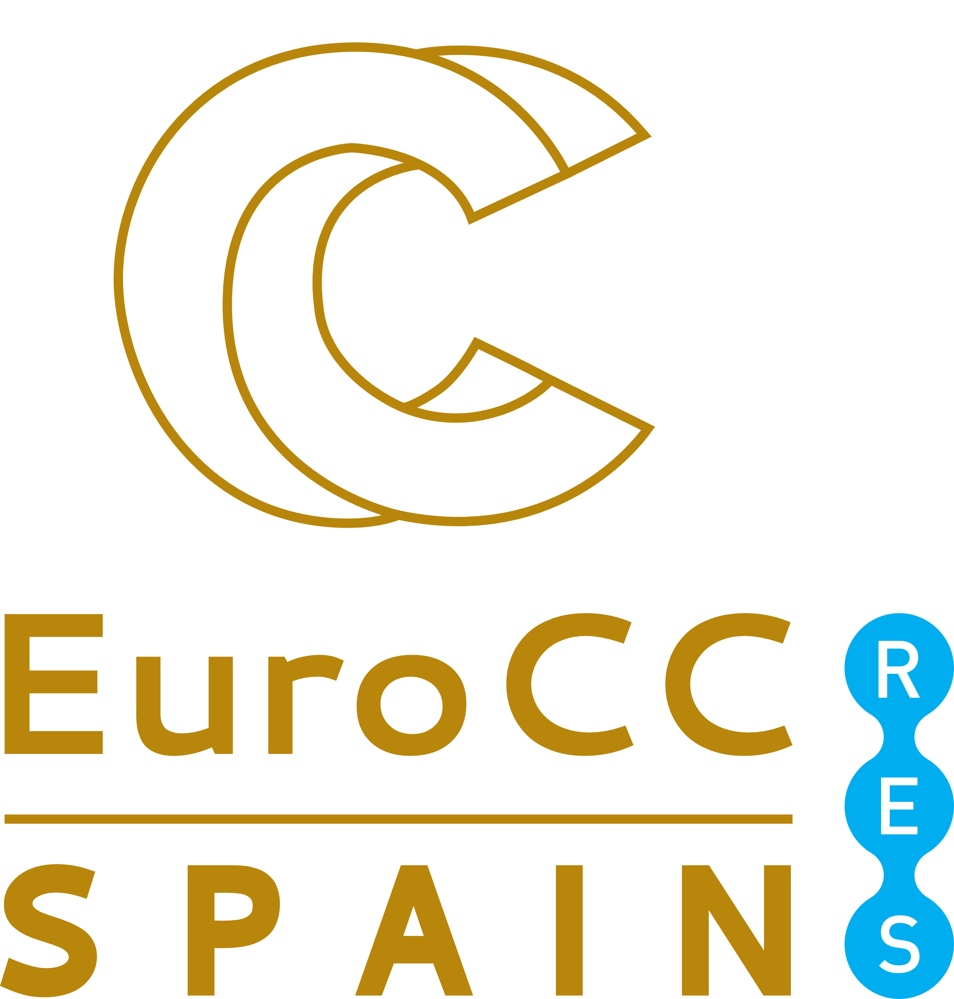

Directorio de información de computación
========================================

Bienvenido al directorio de información de computación del centro de competencia español, `EuroCC_Spain <https://eurocc-spain.res.es/>`_. En este directorio, encontrarás una breve introducción a términos y temas asociados a computación  de alto rendimiento (HPC en inglés), análisis de datos e inteligencia artificial. A su vez, se asocian enlaces y videos que profundizan en los términos. El directorio esta disponible en formato pdf, html y epub.

El directorio se ha elaborado para usuarios tanto principiante como experto en estos temas. Para un conocimiento más profundo, puede escribirnos a eurocc at res.es ( o formulario?).

Contenidos
----------

.. toctree::
   
    hpc
    software
    ad
    ia
    visualizacion
    accesoHPC

